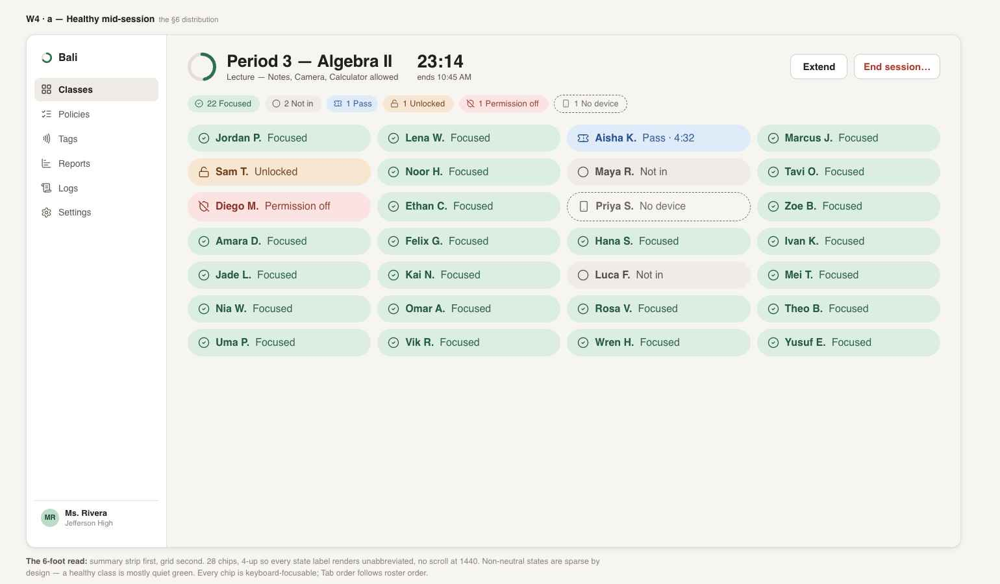
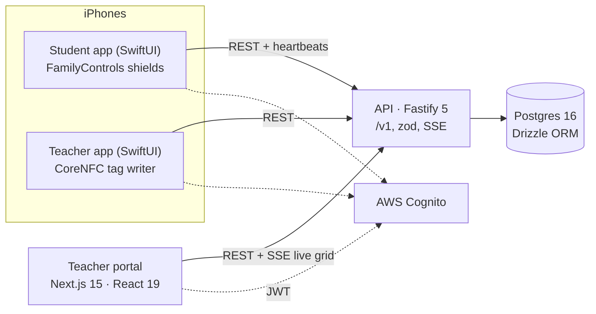

# Bali

**Tap the desk. Phones go quiet. The bell lets you out.**

[](https://github.com/eshan06/bali/actions/workflows/ci.yml)

Bali is a classroom focus tool. A teacher starts a focus session, each student taps the
NFC tag on their desk, and Apple Screen Time shields every app on their iPhone — except a
small set of essentials the student chose once at setup — until the bell. The teacher
watches a live status grid; the student always holds a shame-free emergency exit.


*The teacher live grid (design handoff the build targets — the shipped portal is verified against it).*

## How a session works

1. A teacher signs into the web portal (Google via Cognito) and creates a class, which
   gets an 8-character join code.
2. A student installs the iOS app and does a one-time setup: the privacy contract, the
   Screen Time permission grant, and a single once-ever picker for always-allowed
   essentials (camera, notes, medical apps — Phone and Messages are unblockable on iOS
   regardless). Then they join the class by code or QR.
3. The teacher starts a session from the portal or the teacher iOS app.
4. The student taps the NFC desk tag (written by the teacher app's tag writer) → the app
   applies **full focus**: everything is shielded except the student's one-time allow-list.
5. The teacher's live grid shows each student in one of seven states — `not_joined` /
   `focused` / `pass` / `emergency_unlocked` / `revoked` / `no_device` / `ended` — over
   SSE, with a polling fallback. Passes (bathroom, nurse) are a tap.
6. The student can always leave: a one-second hold on the Emergency control unlocks
   immediately, works offline, and is followed by an optional, skippable reason — never a
   punishment screen.
7. The session ends at the bell (a server-side sweeper) or manually, with a recap.

**What Bali refuses to do:** no screen, app, message, browsing, or location data ever
exists — status only. Reports show class averages, never per-student rankings or
leaderboards. The student's personal history is visible only to the student.

## Architecture



- **`apps/api`** — Fastify 5 JSON API (`:3001`, everything under `/v1`): zod-validated
  routes, Cognito JWT verification, Drizzle → Postgres, an SSE stream per live session
  (snapshot + deltas, poll fallback since `EventSource` can't send auth headers), a
  "bell" sweeper that ends overdue sessions, and per-token rate limiting (a classroom
  shares one IP).
- **`apps/web`** — Next.js 15 App Router: marketing site, teacher portal under `/app`,
  the desk-tag fallback page `/t/[code]`, and a read-only parent view `/p/[token]`.
  Security headers + CSP, and a build-time env guard so a misconfigured production build
  fails instead of shipping.
- **`packages/shared`** — the single source of truth for the seven-state derivation and
  DTO types; the Swift mirror is tested against the same fixtures.
- **`packages/db`** — Drizzle schema (13 tables), SQL migrations, and an idempotent
  demo-world seed.
- **`ios/Bali`** — one Xcode project, four targets: the student app (+ ShieldConfiguration
  and DeviceActivity extensions) and the teacher app, sharing `BaliCore` (Cognito auth,
  API client, NFC parsing, brand tokens).

## Repo map

| Path | What it is |
|---|---|
| `apps/api` | Fastify 5 API — routes, domain logic, SSE live streaming, auth |
| `apps/web` | Next.js 15 teacher portal + marketing + legal pages |
| `packages/shared` | State machine + DTOs shared by api, web, and (mirrored) Swift |
| `packages/db` | Drizzle schema, migrations, seed |
| `ios/Bali` | Student + teacher SwiftUI apps, Screen Time + NFC |
| `scripts/` | `demo.sh` one-command device demo; screenshot + live-API test harnesses |
| `docs/` | Planning and status: discovery, wiring plan, roadmap, production readiness, session handoffs |
| `design_handoff_bali_2` / `design_handoff_teacher_ios` | The high-fidelity design specs the build targets |
| `legacy/` | The frozen v1 app (web/api/db + iOS + Android), kept as reference |

## Running it locally

Node 20+, Postgres (or Docker). Then:

```bash
npm install
cp .env.example .env                          # DATABASE_URL, Cognito ids, DEFAULT_SCHOOL_ID…
cp apps/web/.env.example apps/web/.env.local  # NEXT_PUBLIC_* (API url, Cognito)

npm run db:create      # one-time: creates the database
npm run db:migrate
npm run db:seed        # demo world — Ms. Rivera, "Period 3 — Algebra II", 28 students

npm run dev:api        # Fastify on :3001 (binds 0.0.0.0 so a phone on your LAN can reach it)
npm run dev:web        # Next.js on :3000
```

Or the whole stack in Docker: `docker compose up --build` (Postgres + migrate + api + web;
`NEXT_PUBLIC_*` values ride in as build args — a production web build refuses to compile
with empty Cognito config).

**Tests:** `npm test` — 12 shared unit tests run anywhere; the 12 API integration tests
run only when `TEST_DATABASE_URL` points at a throwaway Postgres (they skip otherwise).
`npm run typecheck` covers every workspace. CI runs typecheck, tests, the web production
build, and the API suite against a Postgres service container.

### The iOS apps

Screen Time shielding and NFC require a **real iPhone** (iOS 16.4+) and a paid Apple
Developer team (the `com.apple.developer.family-controls` entitlement). Copy
`ios/Bali/BaliCore/amplifyconfiguration.example.json` → `amplifyconfiguration.json` with
your Cognito values, then build the `Bali` (student) or `BaliTeacher` scheme.
`./scripts/demo.sh --build` automates the whole device loop: detects your Mac's LAN IP,
starts both servers, rebuilds, reinstalls, and relaunches both apps with the API host
pinned.

## Status

Working end-to-end product, demo-verified on a physical iPhone: web portal, API, and both
iOS apps run the full loop (join → tap-in → shields on → live grid → emergency unlock →
bell). Not yet on the App Store; the current build is a single-school MVP. The paper
trail — discovery, architecture, roadmap, production-readiness audit, per-session
handoffs — lives in [`docs/`](docs/).
